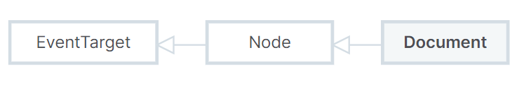

# Introduction

### DOM (Document Object Model)

DOM connects web pages to scripts or programming languages by representing the structure of a document. The DOM represents a document with a logical tree. Each branch of the tree ends in a node, and each node contains objects. DOM methods allow programmatic access to the tree. With them, you can change the document's structure, style, or content.

  

The DOM represents the document as nodes and objects; that way, programming languages can interact with the page.

The DOM is not part of the JavaScript language, but is instead a Web API used to build websites. To begin using the DOM you can use the API directly in JavaScript from within what is called a script, a program run by a browser. When you create a script, whether inline in a _<script>_ element or included in the web page, you can immediately begin using the API for the document or window objects to manipulate the document itself, or any of the various elements in the web page.

#### Document

The Document interface represents any web page loaded in the browser and serves as an entry point into the web page's content. When a member returns an object of type document, this object is the root document object itself. The Document interface describes the common properties and methods for any kind of document.

#### Node

The DOM Node interface is an abstract base class upon which many other DOM API objects are based. Every object located within a document is a node of some kind. In an HTML document, an object can be an element node but also a text node or attribute node.

#### EventTarget

The EventTarget interface is implemented by objects that can receive events and may have listeners for them.

  

