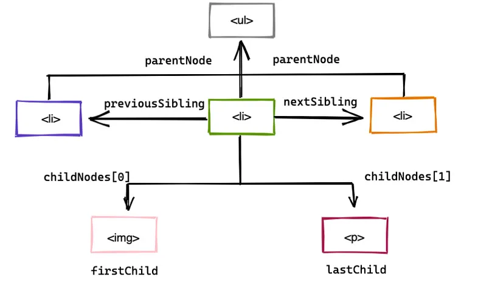

### DOM TRAVERSING

In the previous 02 section,we covered how to use the built-in methods of the `document` object to access HTML elements by ID, class, tag name, and query selectors. We know that the DOM is structured as a tree of nodes with the `document` node at the root and every other node (including elements, comments, and text nodes) as the various branches.

Often, you will want to move through the DOM without specifying each and every element beforehand. Learning how to navigate up and down the DOM tree and move from branch to branch is essential to understanding how to work with JavaScript and HTML.

<p align="center">
  
</p>

The nodes in the DOM are referred to as parents, children, and siblings, depending on their relation to other nodes.

### Parent nodes

| Property          | Gets                |
| ----------------- | ------------------- |
| **parentNode**    | Parent Node         |
| **parentElement** | Parent Element Node |

```html
<body>
  <div class="wrapper">
    <p>.....</p>
  </div>
</body>
```

```javascript
const p = document.getElementsByTagName("p")[0];
console.log(p.parentNode); // <div class="wrapper">...</div>
console.log(p.parentNode.parentNode); // <body>..</body>
```

### Children Nodes

| Property              | Gets                     |
| --------------------- | ------------------------ |
| **childNodes**        | Child Nodes              |
| **firstChild**        | First Child Node         |
| **lastChild**         | Last Child Node          |
| **children**          | Element Child Nodes      |
| **firstElementChild** | First Child Element Node |
| **lastElementChild**  | Last Child Element Node  |

```html
<body>
  <div class="wrapper">
    <ul>
      <li class="item"><p>...</p></li>
      <li class="item"><p>...</p></li>
      <li class="item"><p>...</p></li>
    </ul>
    <p>.....</p>
  </div>
</body>
```

#### ChildNodes

```javascript
const ul = document.getElementsByTagName("ul")[0];
console.log(ul.childNodes);
// `NodeList(7) [text, li.item, text, li.item, text, li.item, text]`
```

In addition to the three `li` elements, it also gets four text nodes. This is because we wrote our own HTML (it was not generated by JavaScript) and the indentation between elements is counted in the DOM as text nodes.

The `children`, `firstElementChild` and `lastElementChild` properties exist in these types of situations to retrieve only the element nodes.

#### firstChild / lastChild

```javascript
const ul = document.getElementsByTagName("ul")[0];
console.log(ul.firtstChild);
console.log(ul.lastChild);
// #text
// #text
```

`ul.firstChild` will return a text node representing the whitespace and newline characters before the first `<li>` element.

#### children

```javascript
const ul = document.getElementsByTagName("ul")[0];
console.log(ul.children);
// HTMLCollection(3) [li.item, li.item, li.item]
```

`ul.children` will return an `HTMLCollection` containing the three `<li>` elements that are the direct children of the `<ul>` element, without any text nodes that might be present due to whitespace or newlines in the HTML.

#### firstElementChild / lastElementChild

```javascript
const ul = document.getElementsByTagName("ul")[0];
console.log(ul.firstElementChild);
console.log(ul.lastElementChild);
// <li class="item"><p>...</p></li>,
// <li class="item"><p>...</p></li>
ul.firstElementChild.styles.background = "red";
ul.firstElementChild.styles.background = "blue";
```

`ul.firstElementChild` will return the first `<li>` element inside the `<ul>` element. `ul.lastElementChild` will return the last `<li>` element inside the `<ul>` element.
