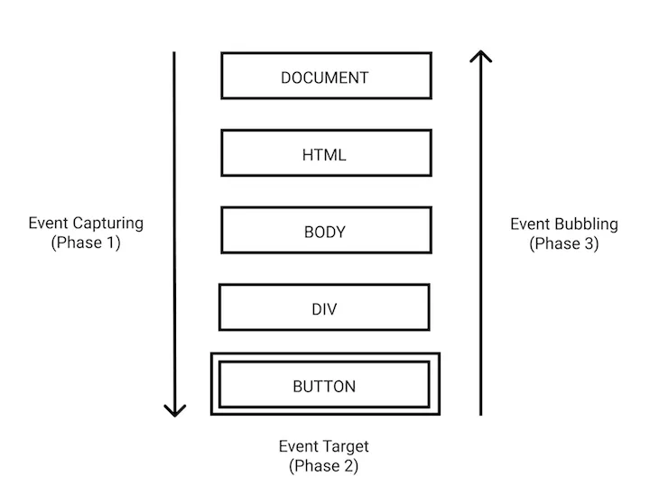

### Event propagation

Event propagation is a mechanism that dictates how events travel through the Document Object Model (DOM) when an event occurs, eventually reaching the target element and possibly executing further actions based on the event. It’s essential for managing how events are handled in a structured manner, especially in complex web applications with nested elements, each potentially having its own event handlers.

#### Phases of Event Propagation

1.  **Capturing (or Capture) Phase:** This is the first phase in the event propagation process. When an event is triggered, it first travels from the root of the DOM tree down towards the target element. During this phase, event listeners can be executed if they are set to capture mode​​.

2.  **Target Phase:** This is the phase where the event reaches the target element on which the event was triggered. Any event handlers attached to the target element are executed during this phase​​.

3.  **Bubbling Phase:** In this phase, the event bubbles up from the target element back to the root of the DOM tree, executing any event listeners in its path, provided they are set to bubble mode​​.

<p align="center">
  
</p>

Let’s say we have 3 nested elements FORM > DIV > P with a handler on each of them:

```html
<style>
  body * {
    margin: 10px;
    border: 1px solid blue;
  }
</style>

<form onclick="alert('form')">
  FORM
  <div onclick="alert('div')">
    DIV
    <p onclick="alert('p')">P</p>
  </div>
</form>
```

A click on the inner `<p>` first runs `onclick`:

1.  On that `<p>`.
2.  Then on the outer `<div>`.
3.  Then on the outer `<form>`.
4.  And so on upwards till the `document` object.

So if we click on `<p>`, then we’ll see 3 alerts: `p` → `div` → `form`.

The process is called “bubbling”, because events “bubble” from the inner element up through parents like a bubble in the water.

### Event target

A handler on a parent element can always get the details about where it actually happened.

The most deeply nested element that caused the event is called a _target_ element, accessible as `event.target`.

Note the differences from `this` and `event.target`:

- `event.target` – is the “target” element that initiated the event, it doesn’t change through the bubbling process.
- `this` – is the “current” element, the one that has a currently running handler on it.

### Stopping bubbling

Any handler may decide that the event has been fully processed and stop the bubbling.

The method for it is `event.stopPropagation()`.

```html
<body onclick="alert(`the bubbling doesn't reach here`)">
  <button onclick="event.stopPropagation()">Click me</button>
</body>
```

### Capturing

To catch an event on the capturing phase, we need to set the handler `capture` option to `true`:

```javascript
elem.addEventListener(..., {capture: true})

// or, just "true" is an alias to {capture: true}
elem.addEventListener(..., true)
```

There are two possible values of the `capture` option:

- If it’s `false` (default), then the handler is set on the bubbling phase.
- If it’s `true`, then the handler is set on the capturing phase.

The code sets click handlers on _every_ element in the document to see which ones are working.

If you click on `<p>`, then the sequence is:

1.  `HTML` → `BODY` → `FORM` → `DIV -> P` (capturing phase, the first listener):
2.  `P` → `DIV` → `FORM` → `BODY` → `HTML` (bubbling phase, the second listener).

```html
<style>
  body * {
    margin: 10px;
    border: 1px solid blue;
  }
</style>

<form>
  FORM
  <div>
    DIV
    <p>P</p>
  </div>
</form>
```

```javascript
<script>
  for(let elem of document.querySelectorAll('*')) {
    elem.addEventListener("click", e => alert(`Capturing: ${elem.tagName}`), true);
    elem.addEventListener("click", e => alert(`Bubbling: ${elem.tagName}`));
  }
</script>
```
