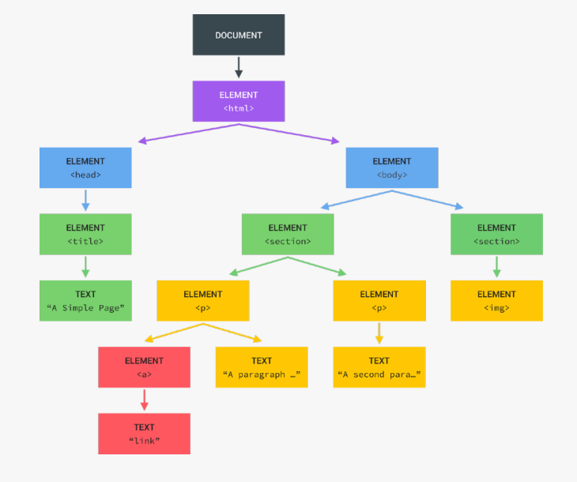

# Introduction

- DOM (Document Object Model)- The Document Object Model (DOM) connects web pages to scripts or programming languages by representing the structure of a document. The DOM represents a document with a logical tree. Each branch of the tree ends in a node, and each node contains objects. DOM methods allow programmatic access to the tree. With them, you can change the document's structure, style, or content.

  

